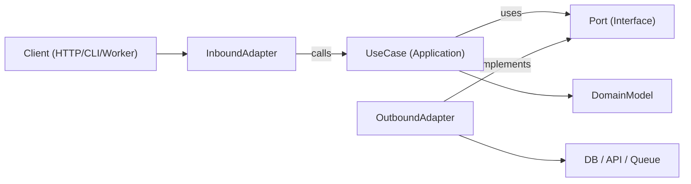

# Hexagonal Architecture (Ports & Adapters)

Business logic is independent of frameworks, transport, and persistence. Core app depends on abstract ports; adapters implement those ports at the edges.

## Triggers

- New feature where testability and long-term maintainability matter
- Domain logic mixed with HTTP/ORM/SDK concerns — needs extraction
- Same use case must serve multiple interfaces (HTTP + CLI + queue + cron)
- Replacing infrastructure (DB, API, message bus) without touching business rules

## Core Concepts

| Layer | What it contains | What it cannot import |
|-------|-----------------|----------------------|
| Domain | Entities, value objects, business rules | Anything framework/infra |
| Application (use cases) | Orchestration, workflow, inbound/outbound port interfaces | HTTP req/res, ORM models |
| Inbound adapters | HTTP controllers, CLI handlers, queue consumers | Business logic |
| Outbound adapters | DB repos, API gateways, event publishers | Other adapters |
| Composition root | Wires concrete adapters to use cases | Must stay in one place |

**Dependency direction always inward:** Adapters → Application → Domain → nothing external

## How to Build

### 1. Define the use case boundary
One input DTO, one output DTO. No `req`, `res`, `Context`, or job payload wrappers inside.

### 2. Define outbound ports first
Every side effect = a port interface. Model capabilities, not technologies.
```
UserRepositoryPort   BillingGatewayPort   LoggerPort   ClockPort
```

### 3. Implement the use case
Receives ports via constructor injection. Validates invariants. Returns plain data.

### 4. Build adapters at the edge
- Inbound: converts protocol input → use-case input
- Outbound: maps port contract → ORM / SDK / raw query
- All mapping stays in adapters, never inside use cases

### 5. Wire in composition root
One place, explicit. No hidden globals, no service locator.

### 6. Test per boundary
- Domain: pure unit tests, no mocks
- Use cases: fakes/stubs for outbound ports
- Adapters: integration tests against real infra (DB, queue, API)
- E2E: full flow through inbound adapter

## Architecture



## Module Layout

```
src/features/orders/
  domain/
    Order.ts
    OrderPolicy.ts
  application/
    ports/inbound/CreateOrder.ts
    ports/outbound/OrderRepositoryPort.ts
    ports/outbound/PaymentGatewayPort.ts
    use-cases/CreateOrderUseCase.ts
  adapters/
    inbound/http/createOrderRoute.ts
    outbound/postgres/PostgresOrderRepository.ts
    outbound/stripe/StripePaymentGateway.ts
  composition/ordersContainer.ts
```

## TypeScript Example

```typescript
// Ports
export interface OrderRepositoryPort {
  save(order: Order): Promise<void>;
  findById(id: string): Promise<Order | null>;
}
export interface PaymentGatewayPort {
  authorize(input: { orderId: string; amountCents: number }): Promise<{ authorizationId: string }>;
}

// Use case
export class CreateOrderUseCase {
  constructor(
    private readonly orderRepository: OrderRepositoryPort,
    private readonly paymentGateway: PaymentGatewayPort
  ) {}

  async execute(input: { orderId: string; amountCents: number }) {
    const order = Order.create(input);
    const auth = await this.paymentGateway.authorize({ orderId: order.id, amountCents: order.amountCents });
    await this.orderRepository.save(order.markAuthorized(auth.authorizationId));
    return { orderId: order.id, authorizationId: auth.authorizationId };
  }
}

// Outbound adapter
export class PostgresOrderRepository implements OrderRepositoryPort {
  constructor(private readonly db: SqlClient) {}
  async save(order: Order) {
    await this.db.query(
      "insert into orders (id, amount_cents, status, authorization_id) values ($1,$2,$3,$4)",
      [order.id, order.amountCents, order.status, order.authorizationId]
    );
  }
  async findById(id: string) {
    const row = await this.db.oneOrNone("select * from orders where id = $1", [id]);
    return row ? Order.rehydrate(row) : null;
  }
}

// Composition root
export const buildCreateOrderUseCase = (deps: { db: SqlClient; stripe: StripeClient }) =>
  new CreateOrderUseCase(
    new PostgresOrderRepository(deps.db),
    new StripePaymentGateway(deps.stripe)
  );
```

## Multi-Language Port Placement

| Language | Ports live in | Wiring in |
|----------|--------------|-----------|
| TypeScript | `application/ports/*` interfaces | factory module |
| Java | `application.port.in/out` interfaces | Spring config or manual |
| Kotlin | `application.port` interfaces | Koin/Dagger/manual module |
| Go | small interfaces in consuming `application` package | `cmd/<app>/main.go` |

## Anti-Patterns

- Domain importing ORM models, web framework types, or SDK clients
- Use case reading from `req`, `res`, or queue metadata directly
- Returning DB rows from use cases without domain mapping
- Adapters calling each other (must flow through use case)
- Dependency wiring scattered across files (hidden singletons)

## Migration Playbook (strangler approach)

1. Pick one high-churn vertical slice
2. Extract use case with explicit input/output types
3. Wrap existing infra calls behind outbound ports (facade first)
4. Move orchestration logic from controller/service into use case
5. Keep old adapter — delegate to new use case
6. Add characterization tests before extraction, unit + integration after
7. Repeat slice-by-slice — no big-bang rewrites

## Checklist

- [ ] Domain/use-case layers import only internal types and port interfaces
- [ ] Every external dependency behind an outbound port
- [ ] Validation at boundaries (inbound adapter + use-case invariants)
- [ ] Immutable transformations (return new values, don't mutate shared state)
- [ ] Infra errors translated to domain/application errors at adapter boundary
- [ ] Composition root explicit and in one place
- [ ] Use cases testable with in-memory fakes
