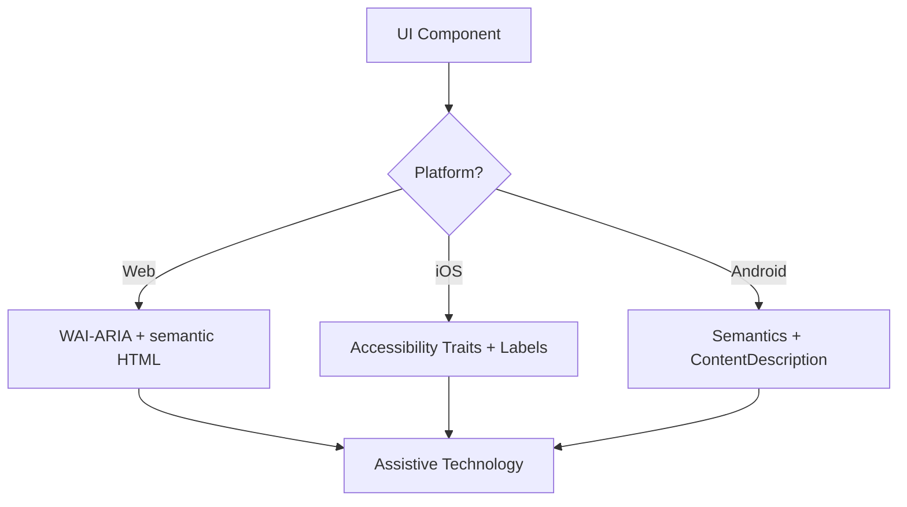

# Accessibility (WCAG 2.2)

## Triggers

- Defining or implementing a UI component on any platform
- Auditing existing code for accessibility barriers or compliance gaps
- "Is this accessible?" / "Add accessibility to this component"
- Implementing new WCAG 2.2 criteria: Target Size (SC 2.5.8), Focus Appearance (SC 2.4.11)

## Core Decision Flow



## Implementation Steps

### 1. Identify role
Use the most semantic native element first. `<button>` over `<div role="button">`. `<a>` over `<span>` with click handler.

### 2. Perceivable
- Text contrast: **4.5:1** (normal text), **3:1** (large text / UI components)
- Non-text content: alt text for images, `aria-label` for icon-only controls
- Reflow: full function at 400% zoom, no horizontal scroll

### 3. Operable
- Target size: **24×24 CSS px** (Web, WCAG 2.2 SC 2.5.8) | **44×44 pt** (Native)
- All interactive elements reachable via keyboard with visible focus indicator (SC 2.4.11)
- Dragging: always provide a single-pointer alternative

### 4. Understandable
- Consistent navigation patterns throughout the interface
- Error messages: text-based, descriptive, with correction suggestion (SC 3.3.3)
- Redundant Entry (SC 3.3.7): never ask for the same data twice in one flow

### 5. Robust
- `Name, Role, Value` pattern on all interactive elements
- Dynamic updates: `aria-live="polite"` (non-urgent) or `aria-live="assertive"` (urgent)

## Cross-Platform Attribute Map

| Feature | Web (HTML/ARIA) | iOS (SwiftUI) | Android (Compose) |
|:--------|:----------------|:--------------|:------------------|
| Label | `aria-label` / `<label>` | `.accessibilityLabel()` | `contentDescription` |
| Hint | `aria-describedby` | `.accessibilityHint()` | `Modifier.semantics { stateDescription = … }` |
| Role | `role="button"` | `.accessibilityAddTraits(.isButton)` | `Modifier.semantics { role = Role.Button }` |
| Live region | `aria-live="polite"` | `.accessibilityLiveRegion(.polite)` | `Modifier.semantics { liveRegion = LiveRegionMode.Polite }` |

## Code Examples

### Web: Accessible Search

```html
<form role="search">
  <label for="search-input" class="sr-only">Search products</label>
  <input type="search" id="search-input" placeholder="Search…" />
  <button type="submit" aria-label="Submit search">
    <svg aria-hidden="true">…</svg>
  </button>
</form>
```

### iOS: Icon-Only Button

```swift
Button(action: deleteItem) {
    Image(systemName: "trash")
}
.accessibilityLabel("Delete item")
.accessibilityHint("Permanently removes this item from your list")
.accessibilityAddTraits(.isButton)
```

### Android: Toggle

```kotlin
Switch(
    checked = isEnabled,
    onCheckedChange = { onToggle() },
    modifier = Modifier.semantics {
        contentDescription = "Enable notifications"
    }
)
```

## Anti-Patterns

| Wrong | Right |
|-------|-------|
| `<div onclick="…">` | `<button>` or `<div role="button" tabindex="0" onkeydown="…">` |
| Color-only error state (red border) | Color + icon + text label |
| Modal without focus trap | `aria-modal="true"` + focus trap + Escape to close |
| Alt text: "Image of a dog" | Alt text: "Golden retriever puppy playing fetch" |
| Focus lost after modal closes | Restore focus to trigger element on close |

## Pre-Ship Checklist

- [ ] All interactive elements ≥ 24×24px (Web) / 44×44pt (Native)
- [ ] Focus indicators visible and high-contrast
- [ ] Modals trap focus while open, release cleanly on close
- [ ] Dropdowns restore focus to trigger on close
- [ ] Forms: text-based error messages with correction hint
- [ ] Icon-only buttons have `aria-label` or `accessibilityLabel`
- [ ] Text scales to 200% without content loss; 400% without horizontal scroll
- [ ] Dynamic content updates announced via live regions

## References

- [WCAG 2.2](https://www.w3.org/TR/WCAG22/)
- [WAI-ARIA Authoring Practices](https://www.w3.org/TR/wai-aria-practices/)
- [iOS Accessibility](https://developer.apple.com/documentation/accessibility)
- [Android Accessibility](https://developer.android.com/guide/topics/ui/accessibility)
